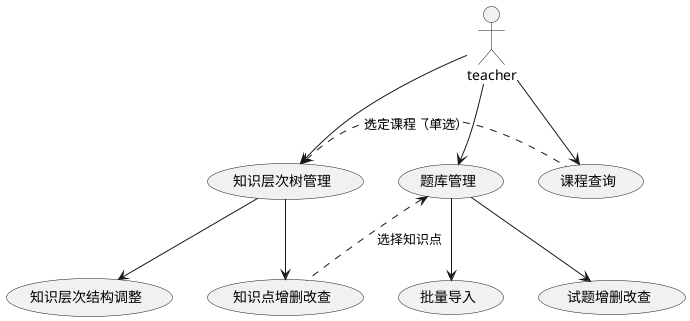

```puml
@startuml


teacher--> (课程查询)
teacher--> (知识层次树管理)
teacher--> (题库管理)
(知识层次树管理)<.(课程查询): 选定课程（单选）
(知识层次树管理)-->(知识点增删改查)
(知识层次树管理)-->(知识层次结构调整)

(题库管理)<. (知识点增删改查): 选择知识点 
(题库管理)--> (试题增删改查)
(题库管理)--> (批量导入)
 


@enduml 
```