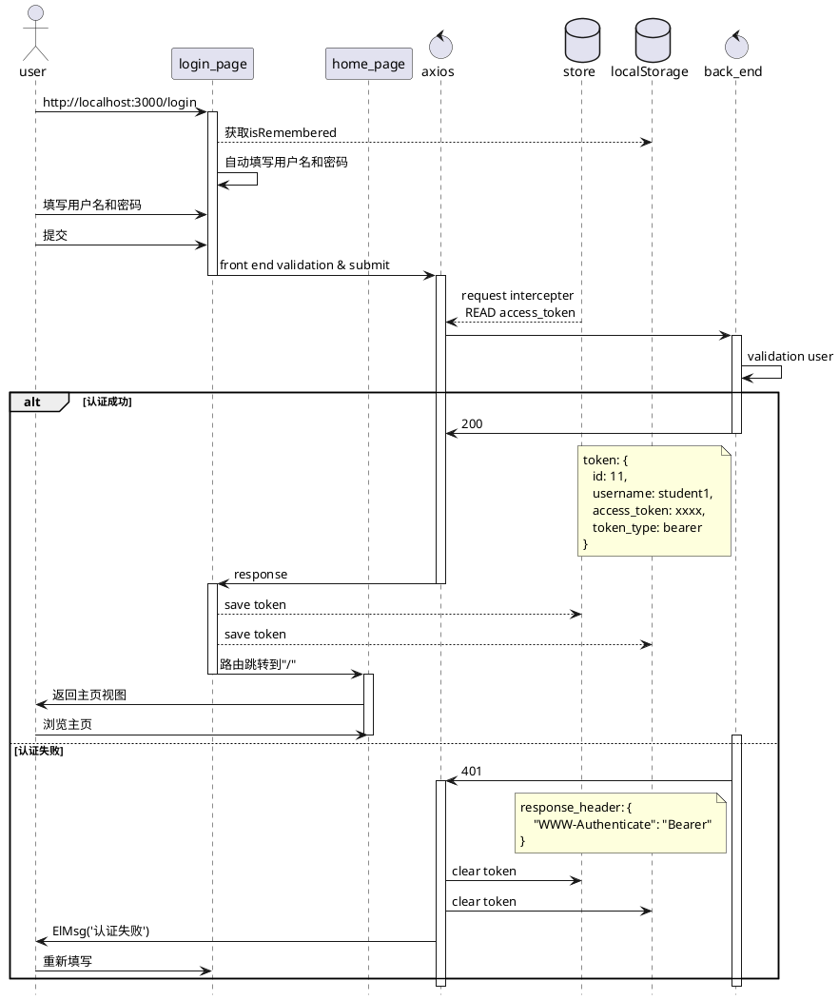

# JWT Token
---

```puml
@startuml
hide footbox
actor user
participant login_page
participant home_page
control axios
database store
database localStorage
control back_end

user->login_page: http://localhost:3000/login
activate login_page
login_page-->localStorage: 获取isRemembered
login_page->login_page: 自动填写用户名和密码
user->login_page: 填写用户名和密码
user->login_page: 提交

login_page->axios: front end validation & submit
deactivate login_page
activate axios

store --> axios: request intercepter\n READ access_token
axios -> back_end
activate back_end

back_end -> back_end: validation user

alt 认证成功
back_end -> axios: 200 
deactivate back_end
note left of back_end
  token: {
     id: 11, 
     username: student1, 
     access_token: xxxx,   
     token_type: bearer
  }
 end note


axios->login_page: response
deactivate axios
activate login_page
login_page --> store: save token
login_page --> localStorage: save token
login_page->home_page: 路由跳转到"/"
deactivate login_page
activate home_page
home_page -> user: 返回主页视图
user->home_page: 浏览主页
deactivate home_page

else 认证失败
activate back_end
back_end -> axios:401
note left of back_end
    response_header: {
        "WWW-Authenticate": "Bearer"
    }
end note
activate axios
axios->store: clear token
axios->localStorage: clear token
axios->user: ElMsg('认证失败')
user->login_page: 重新填写
end
@enduml
```